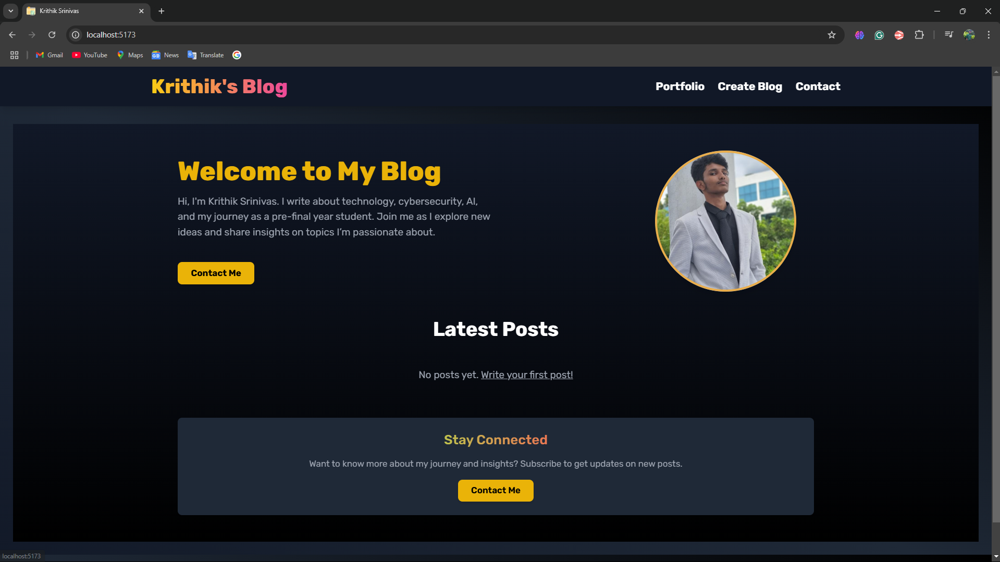
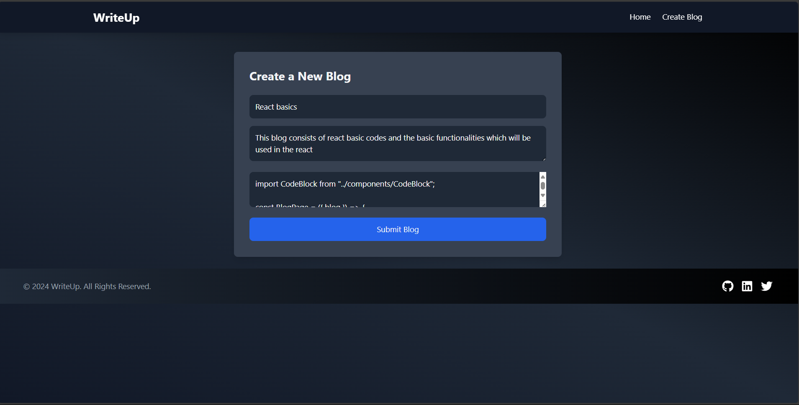
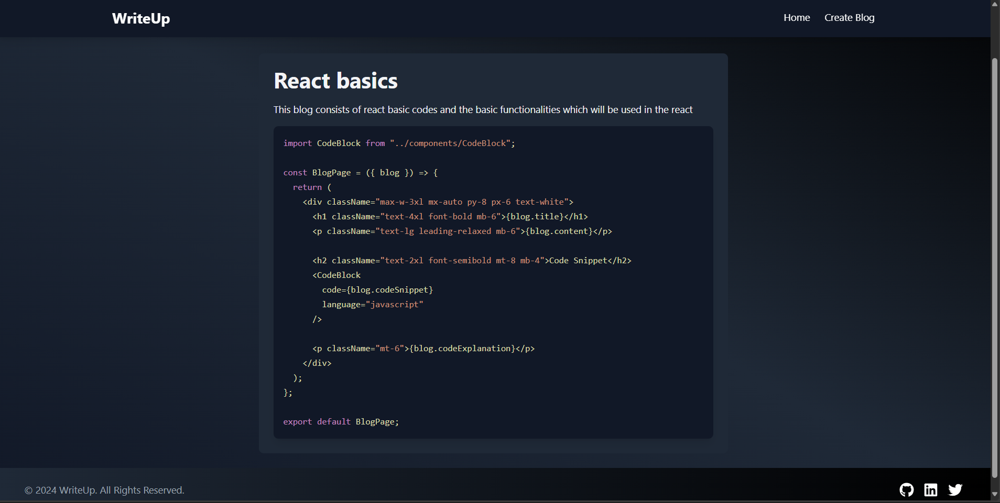

# **WriteUp 📝✨**  



## 🚀 **About the Project**  
**WriteUp** is a dynamic blog platform where users can create, share, and view technical blogs 📚. It features **syntax-highlighted code snippets** 🎨 powered by **PrismJS**, with smooth animations from **Framer Motion** and a responsive design using **Tailwind CSS**. 🌌

This project is built with **React (Vite)** and offers a **dark mode UI** for a sleek developer experience. It’s modular, extendable, and perfect for documenting your coding journey! 💻

---

## 🏗️ **Folder Structure**

```
writeup/
│
├── src/
│   ├── components/         
│   │   ├── Header.jsx      # Responsive Navbar with dynamic Create Blog link
│   │   ├── BlogCard.jsx    
│   │   ├── CodeBlock.jsx   
│   │   ├── Footer.jsx      
│   │   └── Button.jsx      
│   │
│   ├── context/            # Context for authentication
│   │   └── AuthContext.jsx
│   │
│   ├── pages/              
│   │   ├── Home.jsx        
│   │   ├── BlogPage.jsx    
│   │   ├── NewBlogForm.jsx 
│   │   ├── LoginForm.jsx   
│   │   ├── SignupForm.jsx  
│   │   └── ForgotPasswordForm.jsx 
│   │
│   ├── App.jsx             
│   ├── index.css           
│   └── main.jsx            
│
├── public/                 
│   └── index.html          
│
├── package.json            
├── tailwind.config.js      
└── README.md               

```

---

## 🎨 **UI Features**

- **Dark Theme** 🌑 with smooth gradient backgrounds.
- **Responsive Navbar with Sidebar** 📱 for mobile views.
- **Animated Transitions** using **Framer Motion** 🎢.
- **Code Snippets** highlighted with **PrismJS** 🎨.
- **Monospace font** for better readability in code blocks 🛠️.

---

## 🛠️ **Technologies Used**

- **React** ⚛️  
- **Vite** ⚡ (Fast build tool)  
- **Tailwind CSS** 🎨  
- **PrismJS** 🌈 (Code syntax highlighting)  
- **Framer Motion** 🎥 (Animation library)  
- **React Router** 🌍 (Routing)

---

## 📦 **Dependencies**

Here are the main dependencies used in the project:  
```json
"dependencies": {
  "framer-motion": "^11.11.10",
  "prismjs": "^1.29.0",
  "react": "^18.3.1",
  "react-dom": "^18.3.1",
  "react-icons": "^5.3.0",
  "react-router-dom": "^6.27.0"
}
```

---

## 🚀 **Getting Started**

### 1️⃣ Clone the Repository  
```bash
git clone https://github.com/johnwesley755/writeup.git
cd writeup
```

### 2️⃣ Install Dependencies  
```bash
npm install
```

### 3️⃣ Run the Development Server  
```bash
npm run dev
```

### 4️⃣ View in Browser  
Open [http://localhost:5173](http://localhost:5173) 🌐

---

## ✨ **How to Create a New Blog**

1. Click **"Create Blog"** in the Navbar or Sidebar ➕.  
2. Fill out the **title, content, code snippet, and explanation** 📝.  
3. Submit the form, and the new blog will appear on the home page instantly 🏡!

---

## 🖼️ **Screenshots**

1. **Home Page (Blog List)**  


2. **Create Blog Form**  


3. **Blog with Code Snippet**  


---

## 👨‍💻 **Contributing**

Contributions are welcome! 🎉  
Feel free to **fork** this repository and submit a **pull request**. Let's make this project even better together! 🤝

---

## 🌐 **Socials**

- **GitHub**: [johnwesley755](https://github.com/johnwesley755)  
- **LinkedIn**: [John Wesley](https://linkedin.com/in/john-wesley-6707ab258/)  
- **Twitter**: [@JohnWesley97513](https://twitter.com/JohnWesley97513)  

---

## 🛡️ **Upcoming Features**  
- **Search and Filter Blogs** 🔍  
- **Dark/Light Theme Toggle** 🌗  
- **User Authentication** 🔑

---

## 📣 **Acknowledgements**

Thanks to all the amazing open-source libraries and tools used in this project! 💙  

---

## 🎯 **Project Status**

WriteUp is under active development! Stay tuned for updates and new features 🚀.

---
